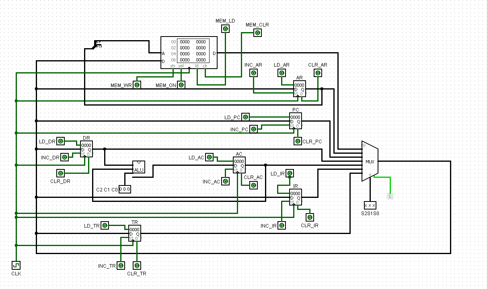
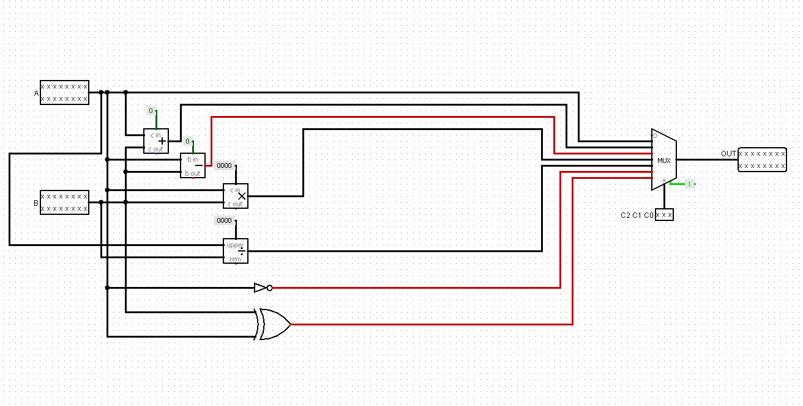

# 💻 16-bit Basic Computer Architecture with ALU (Logisim)

## 🚀 Overview
Design and simulation of a 16-bit basic computer system in Logisim featuring a shared bus architecture, registers, memory unit, control logic, and an Arithmetic Logic Unit (ALU) supporting multiple arithmetic and logical operations.

---

## 📂 Milestones

- 📘 [Milestone 1 – Basic Computer Architecture](./Milestone_1)

---

## 🧠 Features
- 🧮 16-bit computer system design  
- 🔄 Common bus architecture using multiplexer (MUX)  
- 🧠 6 registers:
  - AR (Address Register)  
  - PC (Program Counter)  
  - DR (Data Register)  
  - AC (Accumulator)  
  - IR (Instruction Register)  
  - TR (Temporary Register)  
- 💾 256 × 16-bit memory unit  
- ⚙️ Control logic with clock synchronization  
- ➕ ALU supporting:
  - Data transfer  
  - Addition  
  - Subtraction  
  - Multiplication  
  - Division  
  - Complement  
  - XOR  
- 🔁 Instruction cycle execution  

---

## 🛠️ Technologies Used
- Logisim  
- Digital Logic Design  
- Computer Architecture  

---

## 📂 Project Structure

```text
basic-computer-architecture-alu/
│
├── Milestone_1/
│   ├── basic_computer.circ
│   ├── milestone_1_report.pdf
│   ├── main_circuit.png
│   └── alu.png
│
├── README.md
├── LICENSE
```

---

## ▶️ How to Run

1. Download and install Logisim  
2. Open:
```bash
Milestone_1/basic_computer.circ
```
3. Run the simulation using the clock  
4. Observe:
   - Data transfer through the bus  
   - Register operations  
   - ALU computations  
   - Instruction execution cycles  

---

## 🖼️ System Design

### Main Circuit


### ALU Design


---

## 📄 Project Report
📥 Full detailed report available here:  
👉 [Milestone 1 Report](./Milestone_1/milestone_1_report.pdf)

The report includes:
- System architecture explanation  
- Bus and memory design  
- Register implementation  
- ALU design and operations  
- Instruction cycle execution  
- Testing and validation  

---

## 🧩 How It Works
- A shared 16-bit bus connects all components using a multiplexer  
- Registers and memory exchange data through the bus  
- The ALU performs operations based on control signals  
- Results are stored back in registers or memory  
- The system simulates instruction-level execution step-by-step  

---

## 💡 Future Improvements
- 🧠 Full instruction set implementation (ISA)  
- 🔄 Advanced control unit (microprogrammed)  
- ⚡ Pipeline simulation  
- 📊 Step-by-step execution visualization  

---

## 👨‍💻 Author
Hamza Muhammad Samy Aly Hassanein  
📧 hamzasamy54@gmail.com  
🔗 https://www.linkedin.com/in/hamza-samy-161a74356  
💻 https://github.com/hamzasamyy  

---

## ⭐ If you like this project
Give it a ⭐ on GitHub!
